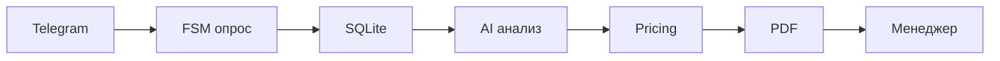

# AI Presale Assistant для Telegram

Рабочий Telegram-бот собирает бриф из пяти вопросов, сохраняет переписку в SQLite и Google Sheets, анализирует заявку через OpenAI, формирует черновик коммерческого предложения в PDF и отправляет материалы менеджеру. Клиент получает только подтверждение передачи заявки; AI-анализ, оценка и PDF ему автоматически не отправляются.

## Стек

- Python 3.11+
- aiogram 3 (long polling, HTML parse mode)
- SQLAlchemy + SQLite
- OpenAI Chat Completions с JSON mode и последующей Pydantic-валидацией
- Google Sheets API через service account
- ReportLab + встроенный Noto Sans для PDF с кириллицей

## Архитектура логики агента



## Сценарий

1. `/start` создаёт заявку и предлагает начать опрос.
2. FSM в памяти последовательно задаёт пять вопросов.
3. Каждый ответ сохраняется в SQLite и дублируется в Google Sheets.
4. После пятого ответа заявка атомарно переводится в `QUALIFIED`, чтобы повторный update не запустил обработку дважды.
5. AI выбирает только ID необходимых модулей и не получает внутренние цены.
6. Детерминированный pricing engine применяет прайс, пакетные правила, минимальную стоимость и шкалу сроков.
7. В фоне выполняются генерация PDF, расширение строки Google и отправка менеджеру.
6. При ошибке AI/PDF заявка не теряется: менеджеру отправляется доступная информация с пометкой о ручной обработке.
7. Дополнительные сообщения прикрепляются к заявке и отправляются менеджеру. Для содержательных изменений устанавливается `proposal_needs_update=true`; нейтральные ответы вроде «Спасибо» или «Ок» не помечают КП как требующее проверки.

Рабочие статусы: `NEW`, `QUESTIONNAIRE_IN_PROGRESS`, `QUALIFIED`, `AI_ANALYZED`, `PROPOSAL_GENERATED`, `SENT_TO_MANAGER`, `MANAGER_REVIEW`, `DONE`. Старые значения `new`, `interview`, `ready` поддерживаются для обратной совместимости.

## Каталог услуг

Каталог возможностей расположен в `data/services_catalog.json`. Его можно расширять без изменения основной логики. Этот файл описывает компетенции и ограничения, но не используется для расчёта цены.

## Расчёт стоимости

Внутренний прайс расположен в `data/pricing.json`, а расчёт выполняет `services/pricing_service.py`. Прайс не передаётся AI: модель возвращает только `selected_services` как массив ID. Pricing engine:

- удаляет дубли и неизвестные ID;
- применяет `includes`, исключая двойное начисление;
- заменяет Wildberries + Ozon пакетной позицией;
- применяет минимальную стоимость проекта 35 000 ₽;
- сохраняет расчётную и итоговую стоимость отдельно;
- определяет `SMALL`, `MEDIUM`, `COMPLEX` или `CUSTOM`;
- выставляет ручную проверку для 1С, неизвестных API и других неопределённых модулей.

В PDF выводится только итоговая стоимость решения. Детальная внутренняя калькуляция отправляется менеджеру. Тарифы сопровождения находятся в том же конфигурационном файле и автоматически в стоимость разработки не включаются.

## Установка

```bash
cd project
python3 -m venv .venv
source .venv/bin/activate
python -m pip install -r requirements.txt
cp .env.example .env
```

Заполните `.env`:

```env
TELEGRAM_BOT_TOKEN=
ROUTERAI_API_KEY=
ROUTERAI_MODEL=google/gemini-2.5-flash-lite
ROUTERAI_BASE_URL=https://routerai.ru/api/v1
OPENAI_API_KEY=
OPENAI_MODEL=gpt-4o-mini
ADMIN_TELEGRAM_ID=
MANAGER_TELEGRAM_ID=
GOOGLE_SERVICE_ACCOUNT_JSON=
GOOGLE_SERVICE_ACCOUNT_FILE=
GOOGLE_SHEET_ID=
GOOGLE_SHEET_GID=
```

Если задан `ROUTERAI_API_KEY` (также поддерживается уже используемое имя `routerai_API_KEY`), AI-запросы идут через RouterAI. По умолчанию используется экономичная модель `google/gemini-2.5-flash-lite`. Если RouterAI не настроен, сохраняется резервное прямое подключение OpenAI.

`MANAGER_TELEGRAM_ID` имеет приоритет. Если он пуст, используется существующий `ADMIN_TELEGRAM_ID`. Бот должен иметь возможность первым написать менеджеру: менеджеру нужно открыть бота и нажать Start. Для Google укажите либо JSON одной строкой в `GOOGLE_SERVICE_ACCOUNT_JSON`, либо путь к файлу в `GOOGLE_SERVICE_ACCOUNT_FILE`.

## Запуск

```bash
python bot.py
```

Одновременно должен работать только один экземпляр long-polling бота с данным токеном.

## PDF

Черновики создаются в `output/pdf/` с именами вида `commercial_proposal_<lead_id>_<date>.pdf`. Шрифт Noto Sans хранится в `assets/fonts/`, поэтому кириллица не зависит от окружения сервера.

## Тесты

```bash
python -m unittest discover -s tests -v
python -m compileall -q bot.py config.py database handlers keyboards schemas services
```

Тесты проверяют каталог, AI JSON, pricing rules, minimum price, includes, пакет Wildberries + Ozon, неизвестные услуги, ручную оценку 1С, PDF с кириллицей и graceful fallback при ошибке PDF. Внешние отправки подменяются и не уходят в реальный Telegram/Google.

## Надёжность

- Секреты читаются только из `.env`.
- Повторная обработка финального сообщения блокируется `processing_message_id` и атомарным переходом статуса.
- Повторное сохранение одного Telegram message ID игнорируется.
- Ошибки OpenAI, Google, PDF и Telegram логируются без API-ключей и не завершают процесс бота.
